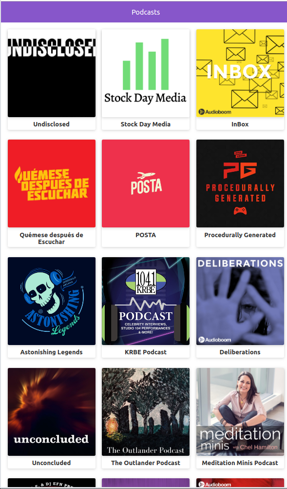
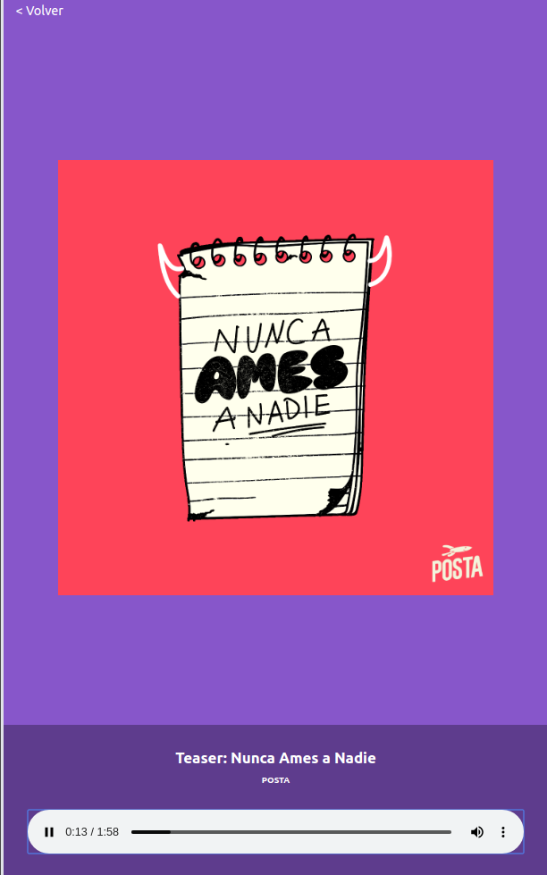

# App de Podcasts

App de Podcasts integrada con la API de AudioBoom para aprender Next.js

[Ver la publicación](https://lab.sebastiancardoso92.now.sh/)

## ¿Cómo funciona?

Requiere Node.Js 10

* `npm i` para instalar las dependencias
* `npm run dev` para el entorno de desarrollo
* `npm run build && npm start` para el entorno de produccion

## Licencia

MIT

## Author

Sebastian Cardoso Castillo (sebastiancardoso92@gmail.com)

...
